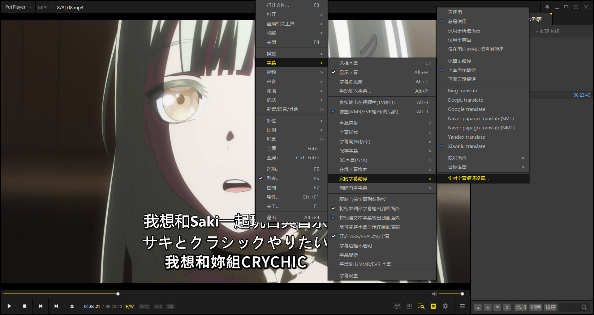
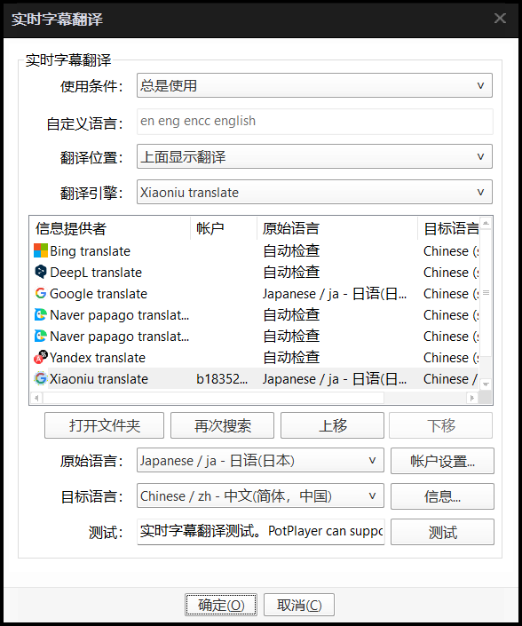
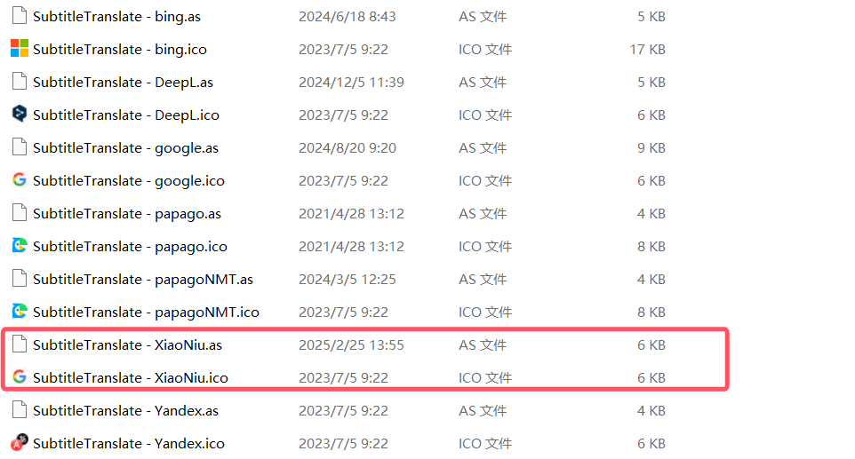
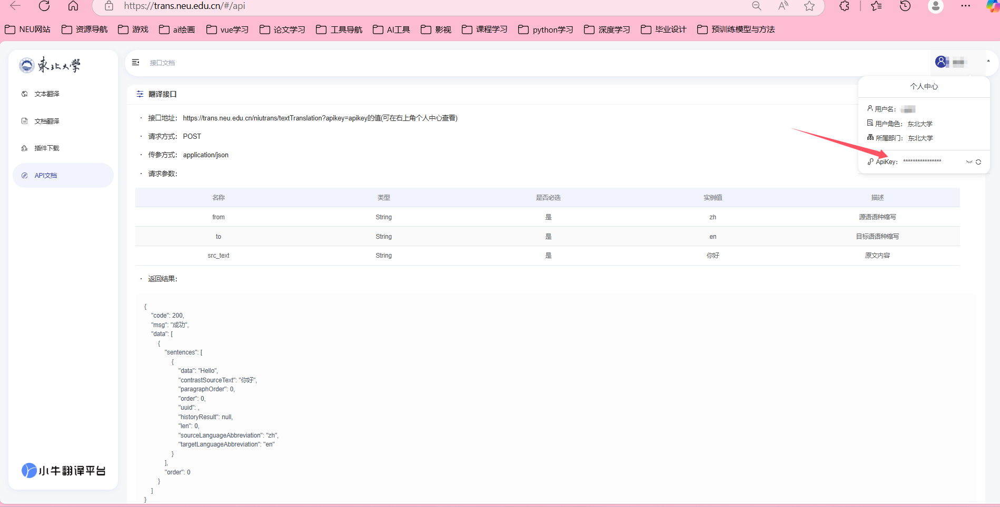
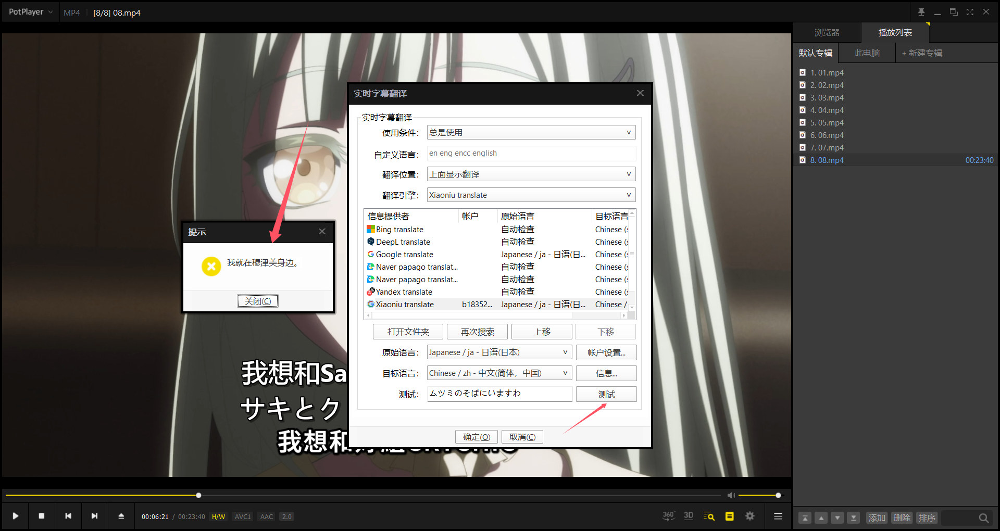
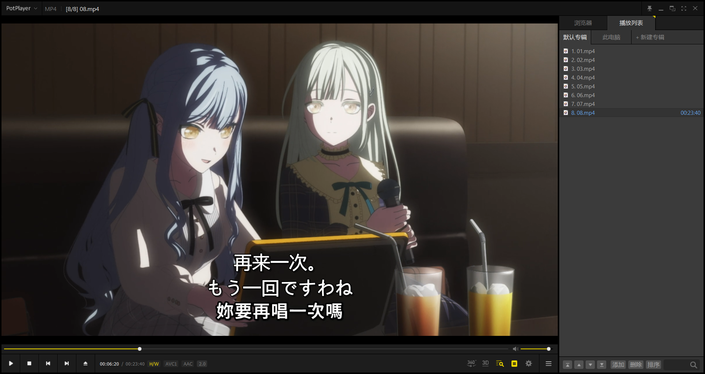
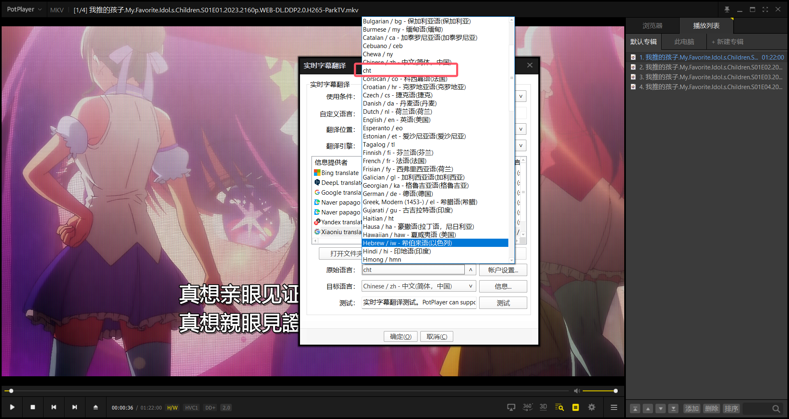

# Plotplayer_niutrans
在Plotplayer中的实时翻译功能中配置小牛翻译(东北大学版)

## 起因
在使用Plotplayer看视频的时候可以使用实时字幕翻译功能，但是默认的翻译引擎都需要付费API，想到小牛翻译为东北大学学生免费提供API，所以按照其他翻译引擎的配置方法，配置了小牛翻译。
(创建有声字幕教程[点击此处](https://blog.csdn.net/duke_ding2/article/details/144973709))

## 使用方法(需要在校园网环境下进行或者使用校园网VPN)
1. 下载本项目中的'配置文件'的两个文件。
2. 按照如下图所示"右键->字幕->实时字幕翻译->实时字幕翻译配置"，点击打开文件夹，得到PlotPlayer的翻译引擎配置文件夹。

3. 将下载的两个文件放入到上一步得到的文件夹中。(因为没找小牛翻译的图标，所以使用谷歌翻译的图标代替了)

4. 打开`SubtitleTranslate - XiaoNiu.as`文件，将第143行的'此处替换为你的APIkey'替换为你的小牛翻译APIkey。'(因为在PlotPlayer输入APIKEY显示用户不存在，于是直接在代码中填入自己的APIKEY直接一劳永逸，小牛翻译APIKEY获取链接[点击这里](https://trans.neu.edu.cn/#/api)，如下图所示)

5. 重启PlotPlayer，然后按照第二步的方法打开翻译引擎配置文件夹，选择小牛翻译引擎，源语言和目标语言，然后测试，测试成功如下图所示。

6. 最终显示效果如下图所示(第一行为小牛翻译翻译结果，第二行为音频提取的转换字幕，第三行为嵌入视频的繁体字幕，具体参照链接[点击此处](https://blog.csdn.net/duke_ding2/article/details/144973709))

## 注意事项
`SubtitleTranslate - XiaoNiu.as`文件中的繁体中文缩写有误，经过查找[小牛翻译API开发文档](https://niutrans.com/documents/contents/trans_json#8)中的语言缩写，繁体中文应该为`cht`，在Plotplayer中选择如下图所示。
